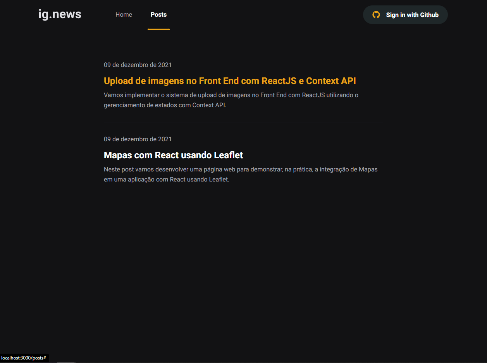
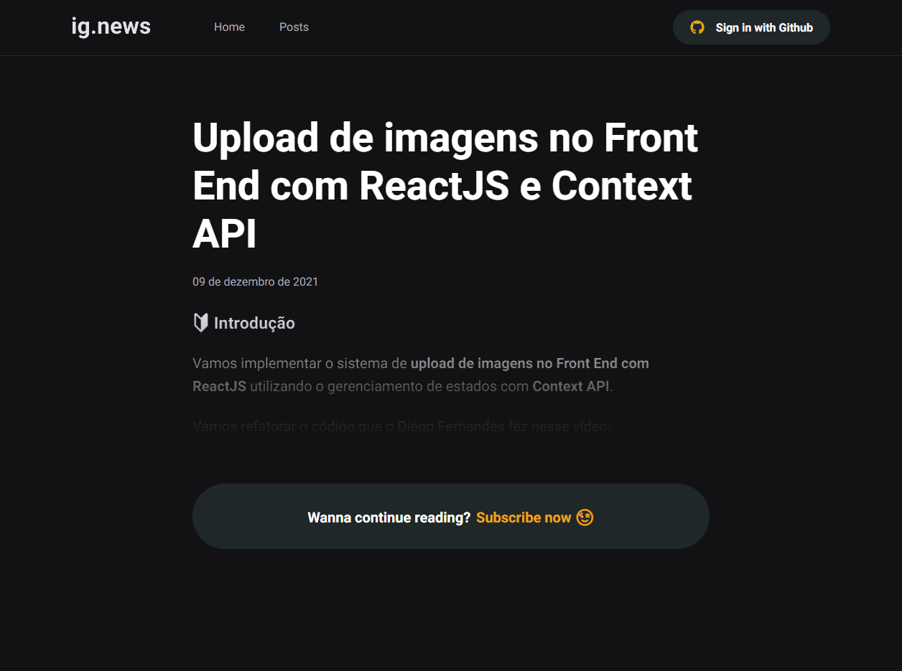
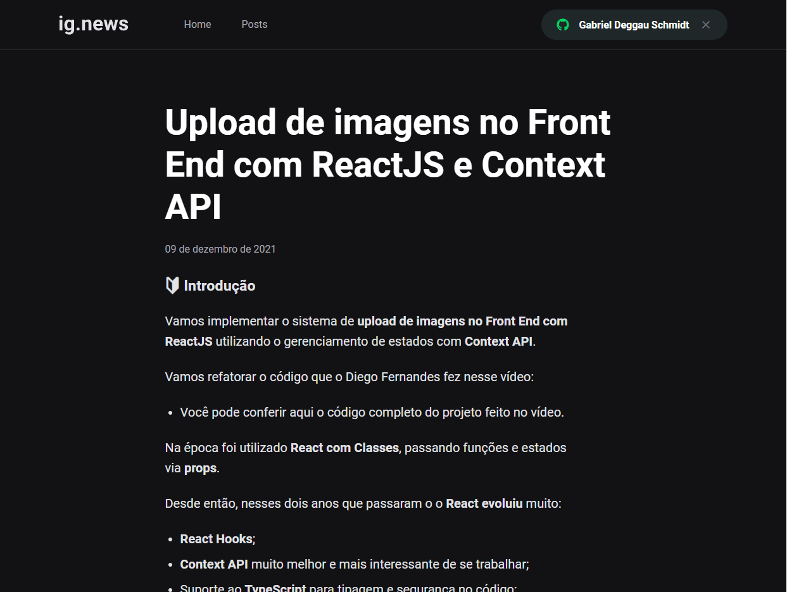

<div align="center">
  
</div>

<h1 align="center">
  ig.news
</h1>

<p align="center">Application to subscribe in a React newsletter using JAM Stack concepts</p>

<p align="center">
 <a href="#about-the-project">About the project</a> •
 <a href="#Technologies">Technologies</a> •
 <a href="#necessary-settings">Necessary settings</a> •
 <a href="#author">Author</a>
</p>

---

## About the project

The goal of this project is to build a application where user is able to subscribe to a React newsletter and read the posts published by some administrator.

The application follows [JAM Stack](https://jamstack.org/) concepts, is was built over NextJS framework using some of their features like API routes, Server Side Rendering (SSR) and Static Site Generation (SSG). In this project we also have integrations with Stripe to user pay the subscription monthly, NextAuth using Github as provider where user is able to login, FaunaBD to save user data and Prismic CMS where some administrator can manage the posts content.

This project was built during module 03 of <b>Ignite</b> course from [Rocketseat](https://rocketseat.com.br/).

---

## Technologies

Follow below the technologies used in this project

- [ReactJS](https://reactjs.org/)
- [NextJS](https://nextjs.org/)
- [TypeScript](https://www.typescriptlang.org/)
- [SASS](https://sass-lang.com/)
- [NextAuth](https://next-auth.js.org/)
- [Stripe](https://stripe.com/)
- [FaunaDB](https://fauna.com/)
- [Prismic CMS](https://prismic.io/)

---

## Necessary settings

### **Requirements**

Tools which should be installed:

- [Git](https://git-scm.com/)
- [Yarn](https://classic.yarnpkg.com)
- [Stripe CLI](https://stripe.com/docs/stripe-cli)

Create and account and do the necessary settings in the following services:

- [Stripe](https://stripe.com/)
- [FaunaDB](https://fauna.com/)
- [Prismic CMS](https://prismic.io/)

### **Cloning the project**

```bash
# Execute command below to clone the project
$ git clone https://github.com/nelsonsantosaraujo/ignews.git
# Access repository folder
$ cd ignews
```

### **Starting the project**

```bash
# Execute yarn to install the dependencies
$ yarn

# In root folder of the project, makes a copy of .env.example file
# Change the name to .env.local
# Add values to variables following the instructions
$ cp .env.local.example .env.local

# Execute stripe listen to listen events emitted by stripe
$ stripe listen --forward-to localhost:3000/api/webhooks

# Run the application
$ yarn dev

```

---

## Screenshots

<div align="center">
    
    
    
    
</div>

---

## Author

Made by Gabriel Deggau Schmidt 👋🏽

[](https://www.linkedin.com/in/gdeggau/)
[](mailto:gabrieldeggau@hotmail.com)
